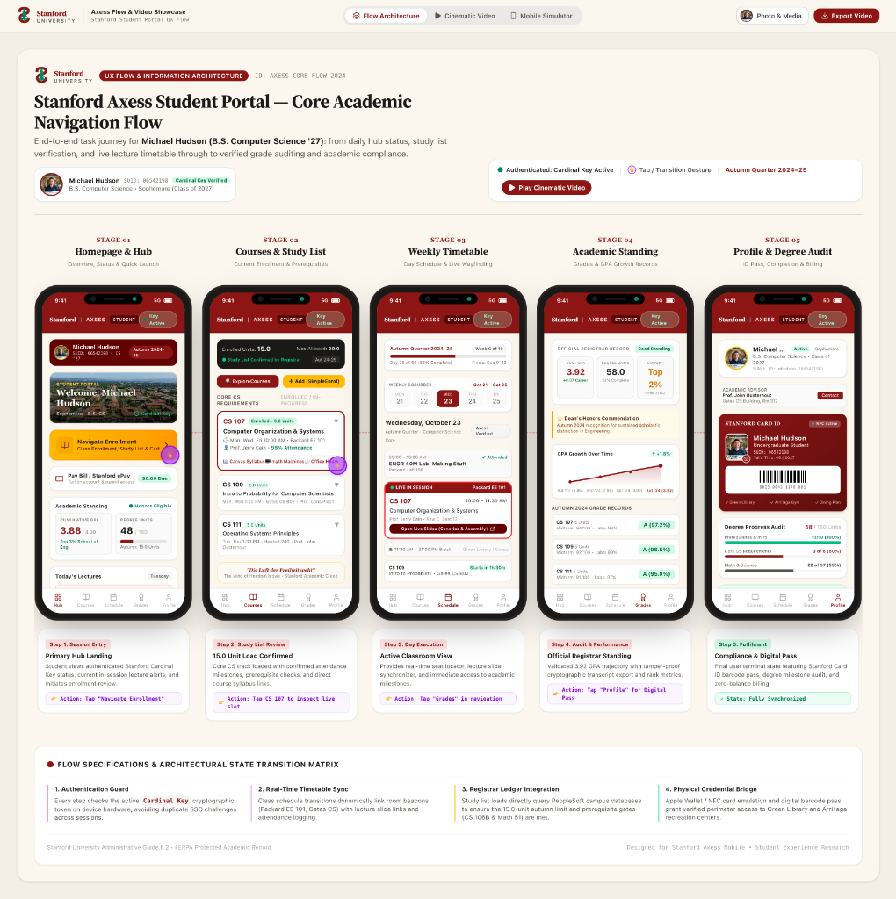

# Stanford Axess Student Portal

Explore the interactive demo: [Stanford Axess Flow Video Generator](https://stanford-axess-flow-video-generator.ai.studio/)

## Table of Contents
- [Overview](#overview)
- [Features](#features)
- [Getting Started](#getting-started)
- [License](#license)

## Overview

The Stanford Axess Student Portal is a modern, premium web application that showcases the core academic navigation flow for Stanford students. Built with React, Vite, and a dynamic UI, it demonstrates:

- Real‑time enrollment overview
- Course schedule visualization
- Grade audit and profile management
- Seamless video export of the user journey

The portal emphasizes a sleek, glass‑morphism style, vibrant gradients, and micro‑animations for an engaging experience.

## Features

- **Flow Architecture**: Visual representation of the student’s daily academic tasks.
- **Video Export**: Generate a video walkthrough of the flow.
- **Customizable Avatar & Campus Images**: Users can upload their own images.
- **Responsive Design**: Optimized for desktop and mobile devices.

## Getting Started

1. Clone the repository.
2. Install dependencies with `npm install`.
3. Run the dev server: `npm run dev`.
4. Visit `http://localhost:5173` to explore the portal.

